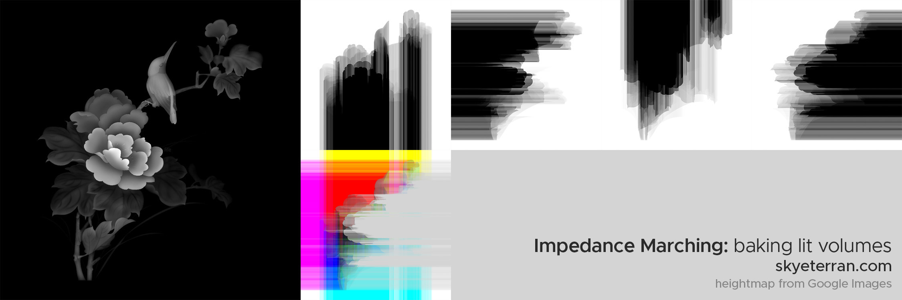
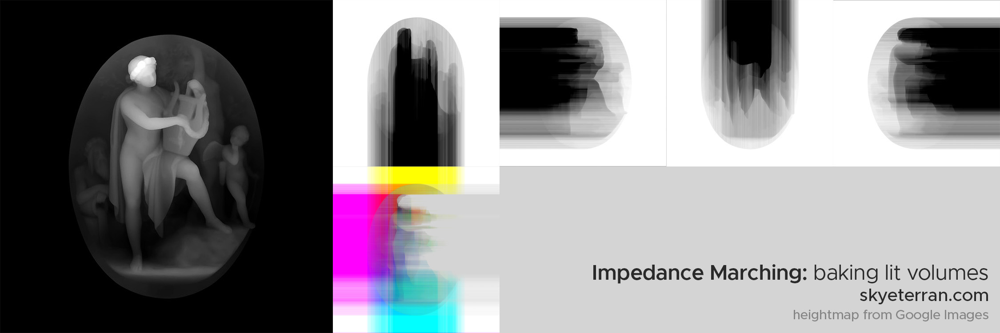
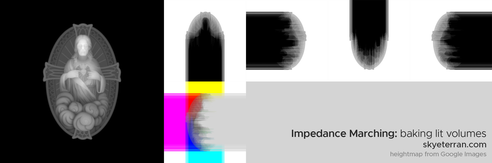
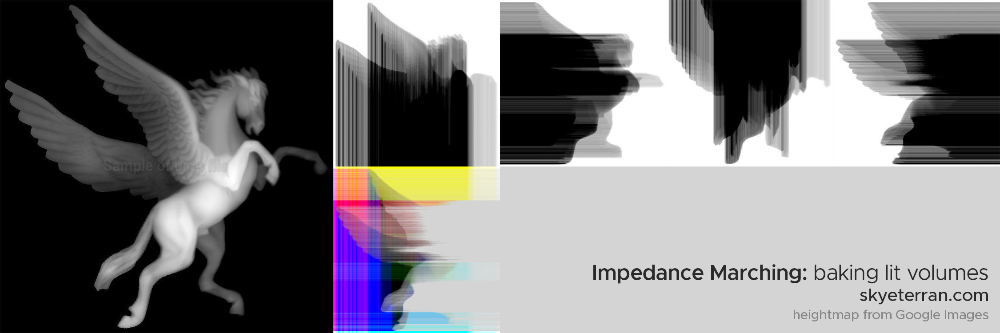
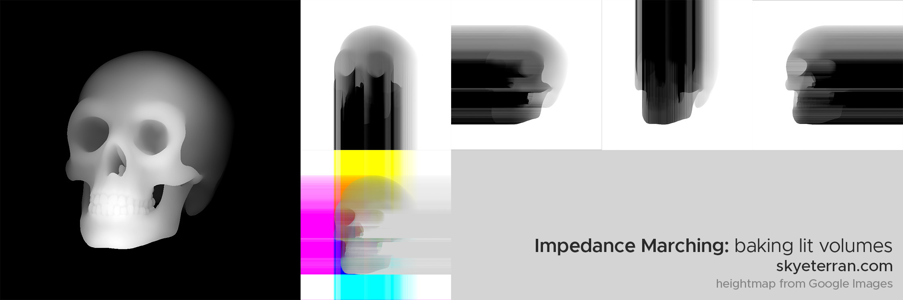

# Impedance Marching
### A technique for baking lit volumes
Impedance Marching is a technique for baking sparsely-directional shadow information for translucent volumes.

As proof of concept, the script included takes a grayscale density map (named Heightmap.png, but this can be changed) and emulates directional light passing through the image as if it were a volume of varying density. It does this 4 times (top -> bottom, right -> left, bottom -> top, left -> right) and stores the resulting "Impedance maps" as 4 grayscale images and one channel-packed RGBA image.

Hypothetically, you could use this technique to bake various directional shadowmaps into a volumetric texture so that you can shade the volume without performing costly realtime raymarching. I'm just testing it on 2D textures at the moment, but it would be relatively simple to create a version that works with 3D textures in the form of 2D slices.

This technique is inspired by raymarching and voxel-based global illumination techniques, specifically in the context of volumes such as fog, smoke or clouds.

## Examples

## Requirements
- Python 3
- Python Imaging Library (PIL)
